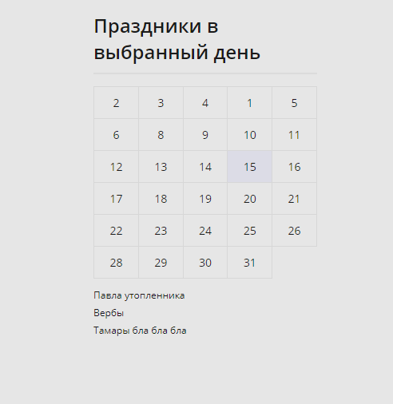
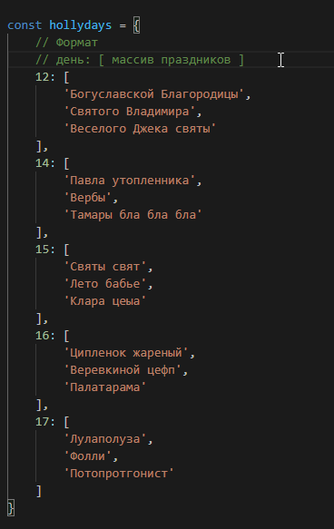

# Holiday-calendar
Monthly Calendar with holydays, or birthdays, or whatever you put in it.

## How it looks:
;

## Add your own stuff:
You can add your holidays or whatever you like to the holidays object in `hollydays.js`.
